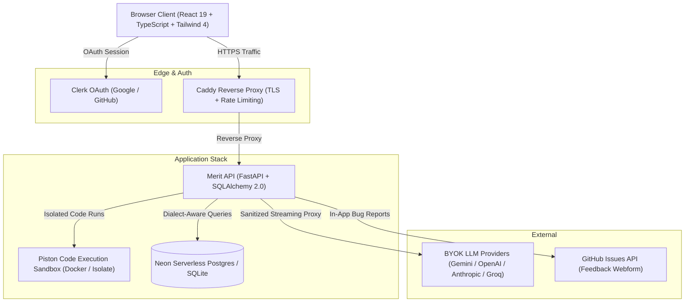

# MERIT — Placement-Grade DSA & Technical Assessment Workbench

> **"Step through the execution, not the explanation. Make the merit list."**

[](https://merit.nullbit.in)
[]()
[]()
[]()
[](LICENSE)

MERIT is an end-to-end technical assessment and Data Structures & Algorithms learning platform tailored for Indian engineering campus placements (TCS NQT Ninja/Prime, Infosys SP/DSE, Cognizant, and product-based hiring drives).

It bridges the gap between passive tutorial consumption and real campus test execution by pairing **frame-by-frame algorithm visualizers** with a **sandboxed code judge**, **tab-switch proctored mock exams**, and a **privacy-first BYOK AI tutor**.

---

## System Architecture



---

## Key Features

### 1. Interactive Algorithm Visualizers (12 Canvas Engines)
* **Frame-by-frame state execution**: Step forward and backward with custom scrubbing speeds (0.25× to 2×).
* **Synchronized pseudocode**: Visual memory pointers and stack frames sync with highlighted logic lines.
* **Supported engines**:
  * **Graph Traversal**: Visual BFS & DFS over customizable adjacency lists and connected components.
  * **Recursion Trees**: Unrolling call stacks and return values for Fibonacci, Subsets, and Divide-and-Conquer.
  * **Linear & Trees**: Binary Search Tree (Insert/Delete/Balance), Min/Max Heaps, Linked Lists, Stack, Circular Queue, Dynamic Array, and Hashing collisions.
  * **Sorting & Searching**: Bubble, Selection, Insertion, Merge, Quick Sort, and Binary Search intervals.

### 2. Full-Length Multi-Section Mock Placement Exams
* **Indian Campus Drive Simulation**: 3-hour holistic assessments featuring:
  * **Section A**: Quantitative Aptitude & Logical Reasoning
  * **Section B**: Core Computer Science (Operating Systems, DBMS, Computer Networks)
  * **Section C**: Hands-on DSA Problem Solving with test case grading
* **Exam Proctoring Engine**:
  * Persistent countdown timer with server synchronization.
  * Fullscreen enforcement & **tab-switch auto-submit detection** to prevent malpractice.
  * HackerRank-style sidebar navigator with answered/flagged/visited question states.

### 3. Curated Problem Bank & Practice Modules
* **140 Verified Problems**: Spanning 17 placement topics with 100% automated Acceptance Criteria (AC) verified against reference solutions.
* **Continuous Doubly-Linked Sequences**: Seamless "Next in Category" navigation ordered strictly by pedagogical difficulty (`Easy` $\rightarrow$ `Medium` $\rightarrow$ `Hard`).
* **539 Verified Multiple-Choice Questions**: High-yield conceptual quizzes with timed locks, detailed explanations, and anti-pattern analysis.

### 4. Zero-Liability BYOK AI Tutor
* **Bring Your Own Key**: Works with free Gemini API keys, OpenAI, Anthropic, DeepSeek, and Groq.
* **Zero Server Storage**: API keys reside strictly on the user's client device and are transmitted ephemerally to the tutor proxy.
* **Chain-of-Thought Sanitization**: Backend and frontend filters strip internal reasoning tags (`<thought>`, `<think>`) to ensure clean, pedagogical hints without leaking solutions.

### 5. In-App Bug & Test Case Feedback Webform
* Self-hosted dialog accessible across the application.
* Automatically captures problem context, page route, and error details, filing tracked issues directly into the public GitHub issue tracker via the GitHub REST API.

---

## Engineered for Low-Cost Infrastructure

Merit was intentionally architected to operate **100% free of cloud compute costs** on a single Oracle Cloud Free Tier AMD instance (1 vCPU / 1GB RAM) without triggering Linux OOM crashes:

| Container | Memory Limit | Memory Reservation | Purpose |
| :--- | :---: | :---: | :--- |
| **merit-piston** | `300MB` | `150MB` | Sandboxed compiler & runner via Linux namespaces/cgroups |
| **merit-api** | `350MB` | `200MB` | FastAPI uvicorn worker, SQLAlchemy ORM, and rate-limiting |
| **merit-web** | `64MB` | `32MB` | Production Nginx serving gzip-compressed single-page app |
| **OS & Buffer** | `~310MB` | — | Kernel headroom, swap cache, and Caddy TLS terminator |

* **Total Memory Budget**: Stack caps itself at **714MB**, leaving ample headroom on a 1GB host.
* **Dialect-Aware Persistence**: Zero-configuration SQLite for local offline development; automatic dialect branching for Neon Serverless PostgreSQL with atomic upserts in production.

---

## Monorepo Layout

```text
.
├── apps/
│   ├── api/                 # FastAPI backend
│   │   ├── app/
│   │   │   ├── models/      # SQLAlchemy ORM models
│   │   │   ├── routers/     # Auth, Judge, Quizzes, Tutor, Feedback, Progress
│   │   │   ├── schemas/     # Pydantic validation schemas
│   │   │   └── seed.py      # Problem and question seed loaders
│   │   └── tests/           # 121 Pytest unit and integration tests
│   └── web/                 # React 19 single-page application
│       ├── src/
│       │   ├── components/  # Modals, Navbars, CodeRunner, QuizEngine, Tutor
│       │   ├── pages/       # Problems, Exams, Dashboard, Profile, Landing
│       │   ├── visualizers/ # 12 interactive canvas algorithm engines
│       │   └── store/       # Auth & Progress state contexts
│       └── tests/           # 138 Vitest component tests
├── content/
│   ├── problems/            # 140 authored problem JSON specifications
│   ├── questions/           # 539 verified multiple-choice question datasets
│   ├── generators/          # Problem Authoring Framework (PAF) & TS sync scripts
│   └── validators/          # Automated content & reference solution AC gates
├── docker-compose.yml       # Production multi-container composition
└── Caddyfile                # Reverse proxy with automatic HTTPS
```

---

## Quickstart (Local Development)

### Prerequisites
* **Node.js**: v20+
* **Python**: v3.11+
* **Docker & Docker Compose** (optional, for full sandboxed judge)

### 1. Clone the Repository
```bash
git clone https://github.com/abhigyan-chatterjee/merit.git
cd merit
```

### 2. Backend Setup
```bash
cd apps/api
python3 -m venv .venv
source .venv/bin/activate
pip install -e .

# Run database migrations and seed problems
python -c "from app.db import Base, engine, SessionLocal; from app.seed import seed_all; Base.metadata.create_all(bind=engine); db=SessionLocal(); seed_all(db); db.close()"

# Start API server
uvicorn app.main:app --reload --port 8000
```

### 3. Frontend Setup
```bash
cd apps/web
npm install
npm run dev
```
Open [http://localhost:5173](http://localhost:5173) in your browser.

---

## Running Test Suites

### Backend Unit & Integration Tests (121 tests)
```bash
cd apps/api
pytest -q
```

### Frontend Component & Route Tests (138 tests)
```bash
cd apps/web
npm test
```

### Problem & Question Content Verification Suite
```bash
python3 content/validators/run_all.py
```

---

## Contributing & Bug Reports

Found an incorrect test case, edge case bug, or explanation typo?
* Use the in-app **Report Bug / Feedback** button in the footer or navbar.
* Or open an issue directly in the [GitHub Issue Tracker](https://github.com/abhigyan-chatterjee/merit/issues).

---

## License

This project is licensed under the [MIT License](LICENSE) — Copyright (c) 2026 Abhigyan Chatterjee.
